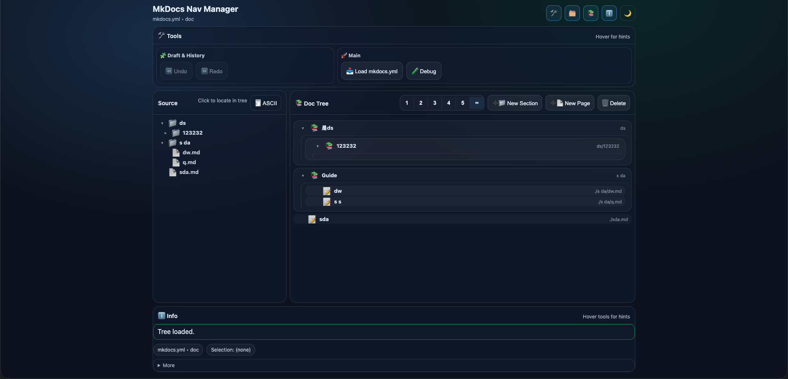
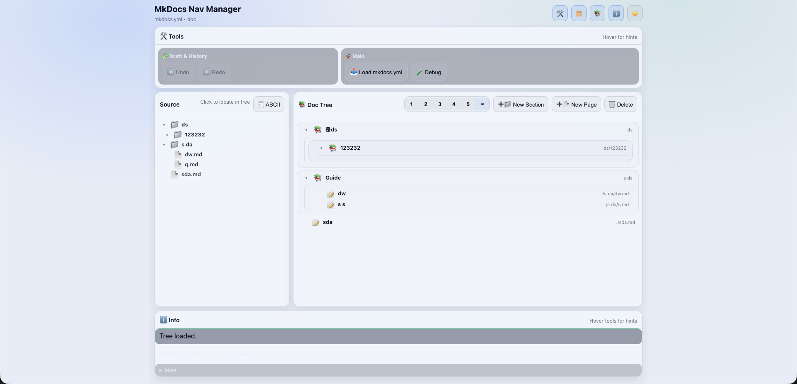

# MkDocs Nav Manager

Drop `MkDocs_Nav_Manager/` into the root of your MkDocs project (next to `mkdocs.yml`) to edit `nav` using a Confluence-like page tree and keep `docs/` (or `doc/`) synced on disk.

## Quick Start

`pip install -r MkDocs_Nav_Manager/requirements.txt`

`python MkDocs_Nav_Manager/app.py`

Open: `http://127.0.0.1:5000`

## UI Features

- Dockable layout: toggle `Tools`, `Source`, `Doc Tree`, and `Info`; drag splitters to resize.
- Source explorer: browse markdown files, click to locate in Doc Tree; optional ASCII view.
- Doc Tree editor: Confluence-like hierarchy where sections visually contain children.
- Precision drag & drop: blue indicator line + mouse-position detector (before/after/inside).
- Inline rename (no dialogs): double-click page title, section folder segment, or page filename (basename only).
- Safe deletes: blocks deleting non-empty sections; deleting a page also deletes its `.md` and sibling asset folder.
- Undo/Redo (file-aware): updates both tree and filesystem; keeps last 5 steps in browser storage.
- Conflict safety: if a target path already exists, sync is blocked and nothing is written/changed.
- Day/Night theme toggle and optional Debug panel.

## Defaults

- `mkdocs.yml`: project root `mkdocs.yml` (override with `MKDOCS_PATH`)
- `docs_root`: uses `docs_dir` when set, otherwise auto-detects `docs/` or `doc/` (override with `DOCS_ROOT`)
- State file: `MkDocs_Nav_Manager/.page_tree_state.json` (override with `STATE_PATH`)
- Backups: creates `MkDocs_Nav_Manager/backups/mkdocs/` (keeps latest 5), disable with `MKDOCS_BACKUP=0`

## Troubleshooting

- Port 5000 in use: `lsof -nP -iTCP:5000 -sTCP:LISTEN` or start on another port.
